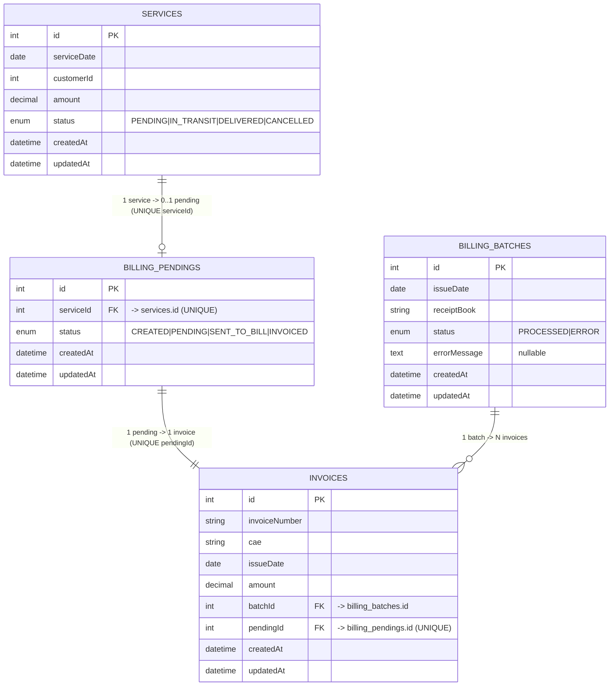

# Challenge Tecnosotware - Explicación Técnica

## <u>Proceso de desarrollo</u>

Al principio comencé analizando el codigo y haciendo diferentes anotaciones que se pedian dentro de los requisitos.

Comencé reorganizando los dominios funcionales para que hicieran lo que se solicitaba.

Lo que hice fue :

- Modificar los estados a BillinPending ()

- Modificar los estados a Services ()

- Modificar las uniones entre BillingPending e Invoice, para que cumplan el requisito de **"un pendiente solo puede ser facturado una vez"** agregando un @Index({ unique: true }) y cambiando las relaciones @ManyToOne y @OneToMany por @OneToOne
  
  

Luego de estos cambios, el Diagrama de la BBDD quedaría así:

    

## <u>Creación de la Arquitectura</u>

Al leer detalladamente los requerimientos de la aplicación, elegí hacer la solucion en base a Hexagonal Arquitecture. La decision la tomé porque lo que se quiere es diferenciar dominios entre servicio de logistica y facturación, dentro de la aplicación y esto lo puede solucionar muy facilmente esta arquitectura.

